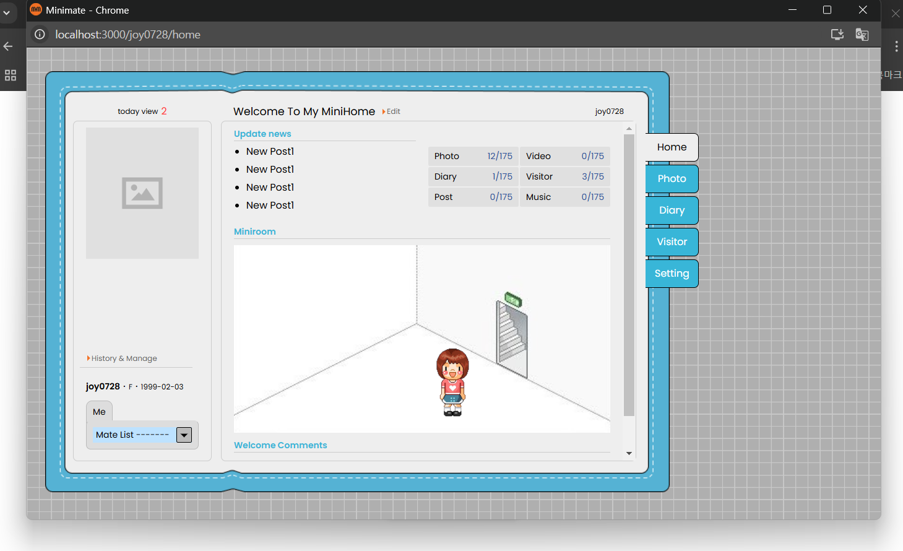
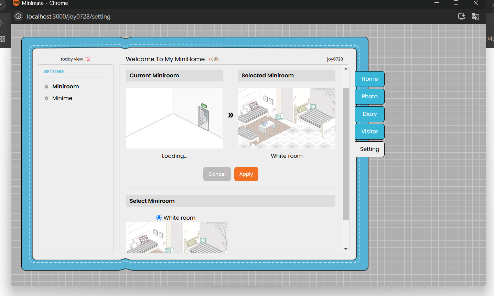
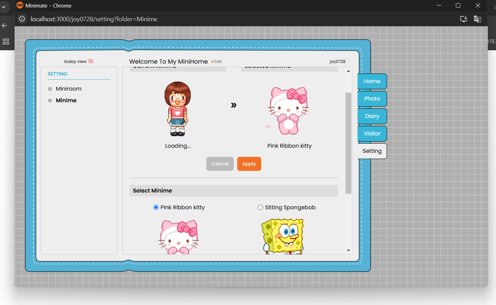
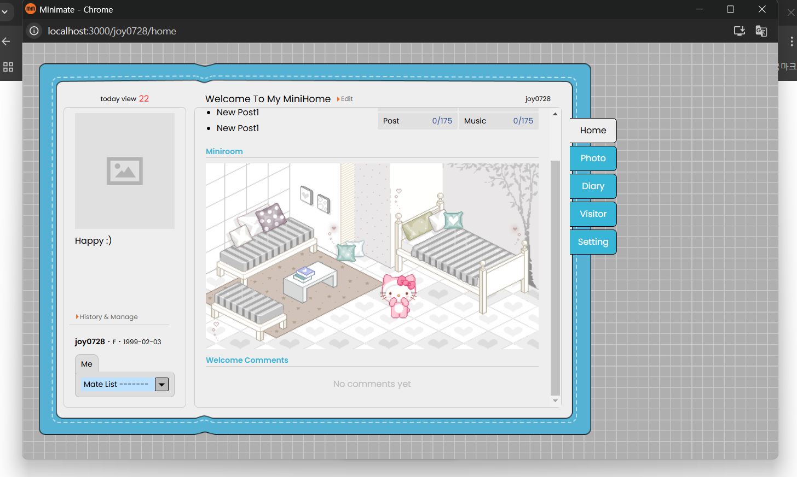
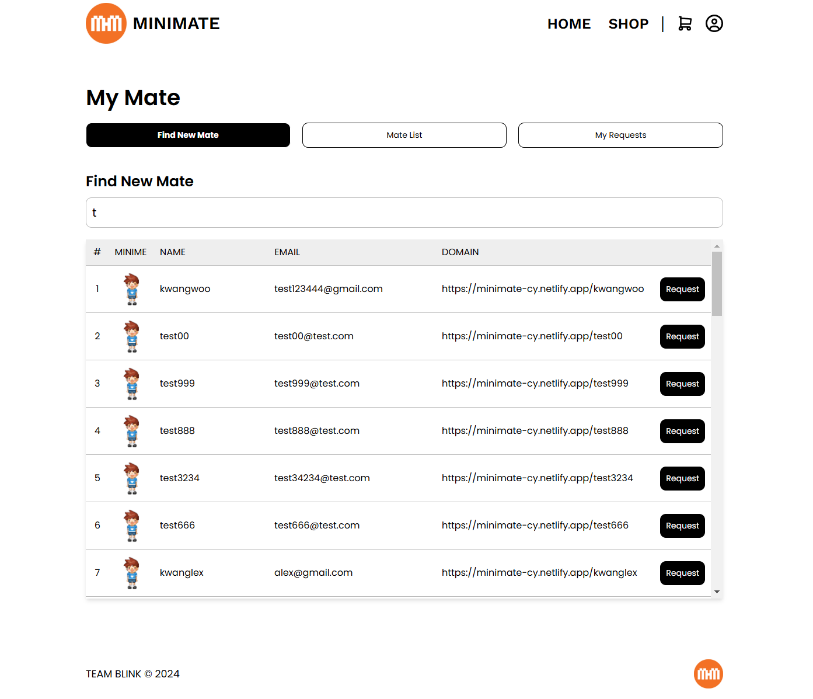
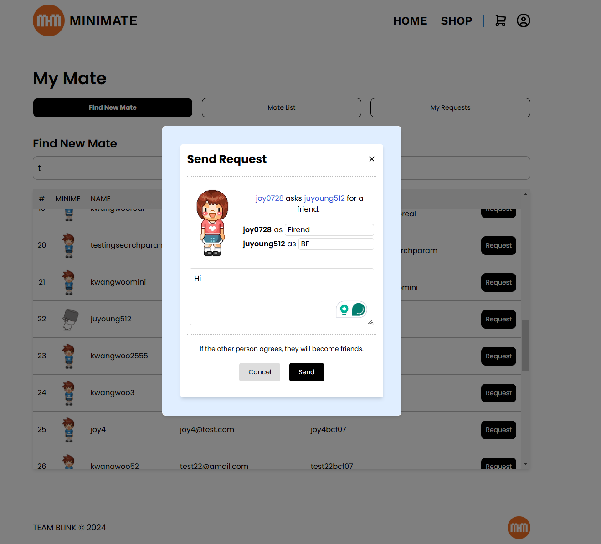
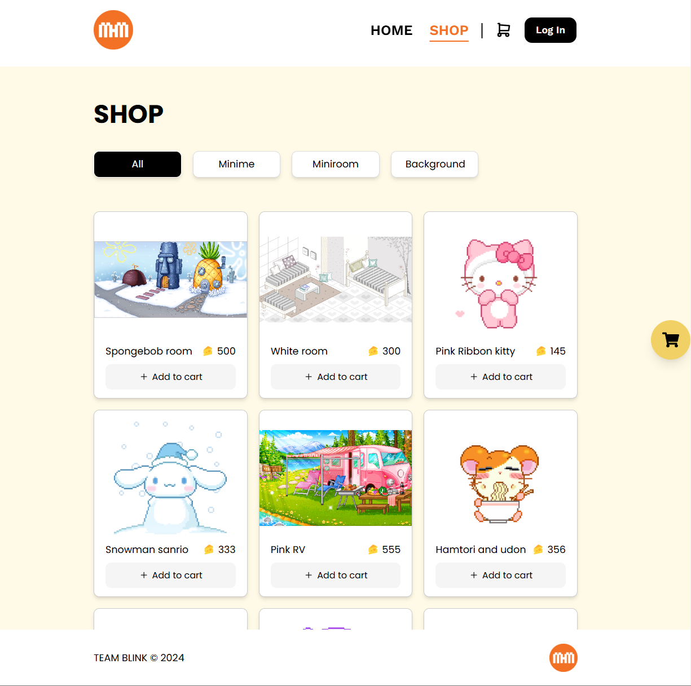
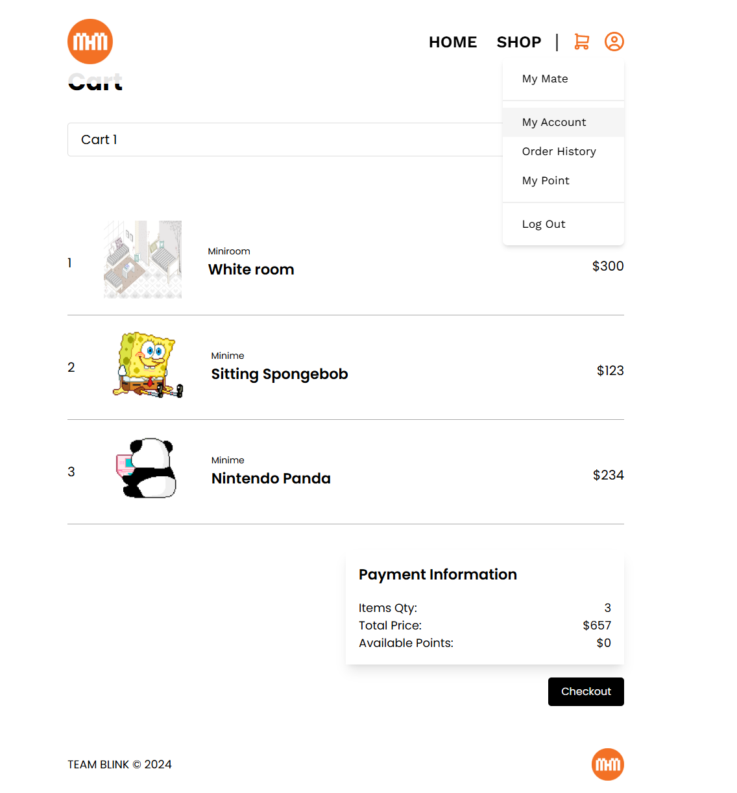

# Minimate

## ⚠️ Project Status

This project was originally built as a full-stack application, but the backend service is currently inactive.

Some features such as authentication and data-driven interactions are not available.

The project is best reviewed through screenshots and code structure.

---

## 🚀 Overview

Minimate is a Cyworld-inspired social platform where users can create and customize personal mini-homepages, connect with friends, and purchase virtual items.

This project integrates social networking, personalization, and a shop system into a single React-based application.

---

## ✨ Key Features

- MiniHome customization (avatar, room, UI updates)
- Social features (friend system, visitor book)
- Shop & cart system with purchase flow
- Managed global state across multiple features using Redux Toolkit

---

## 🎯 What I Focused On

- Managing complex global state across multiple features using Redux
- Designing reusable UI components for scalability
- Structuring frontend architecture based on REST APIs
- Handling user interactions across multiple pages and flows

---

## 🖥️ Screenshots

### 🏠 Minihome Customization Flow

Mini-home updates dynamically based on user selections.

(Default → Room → Avatar → Final Result)

  
  

  
  

---

### 👥 Friend System

Search users, send requests, and manage connections.

  
  

---

### 🛒 Shop

Browse and explore customizable items.

  

---

### 💳 Cart

Manage selected items before checkout.

  

---

## 🛠️ Tech Stack

### Frontend

- React.js
- Redux Toolkit
- Tailwind CSS

### Backend

- Node.js
- Express.js
- MongoDB
- REST API

---

## ⚡ Challenges

- Faced CORS and authentication issues during deployment
- Managed synchronization between UI and async data flow
- Built frontend based on API structure without full backend control

---

## 👩‍💻 Author

Juyoung Lee  
GitHub: https://github.com/Joy-Juyoung
