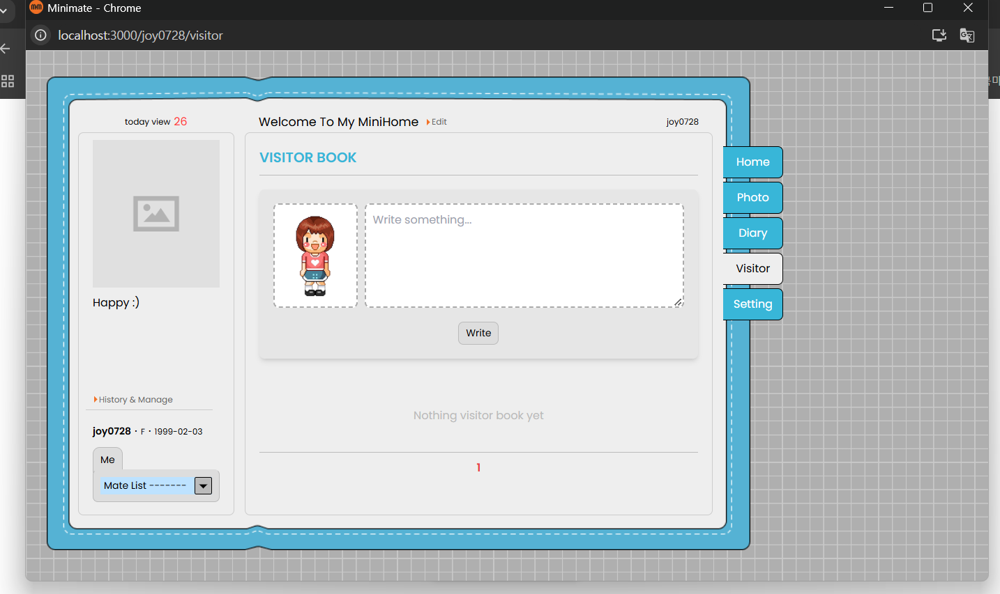
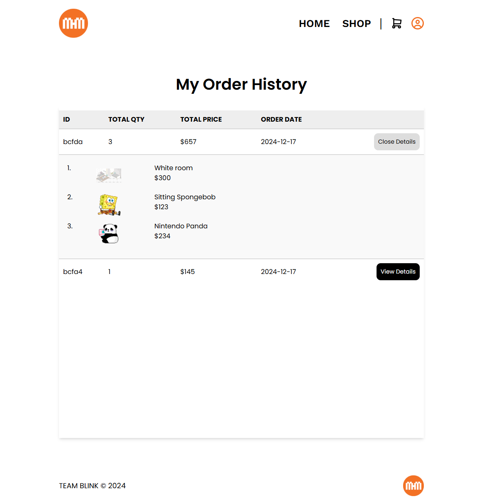

# 🏠 Minimate

## 🚀 Overview

Minimate is a Cyworld-inspired social platform where users can create and customize personal mini-homepages, connect with friends, and purchase virtual items.

This project integrates social networking, personalization, and a shop system into a single React-based application.

---

## 🎯 Core Systems

### 🏡 MiniHome (Core Feature)

- Personal virtual space for each user
- Customizable miniroom and avatar (minime)
- Visitor book and user interaction

### 👥 Friend System

- Search users by name, email, or domain
- Send and manage friend requests
- Access friends' mini-homepages

### 🛒 Shop & Cart System

- Browse items by category
- Add to cart and purchase using points
- Order history tracking

---

## 🗓️ Project Timeline

- Apr 2024 – Aug 2024

---

## ✨ Key Features

### 👥 Social Features

- Friend search and request system
- Mate list (friend list) management
- Guestbook (visitor book) interactions

### 🎨 Customization

- Customize mini-homepages
- Change miniroom (background)
- Change minime (character/avatar)

### 🛒 Shop & Commerce

- Item browsing by category
- Cart and checkout system
- Point-based payment
- Order history

### 👤 Account

- Login / Signup
- User profile management

---

## 🖥️ Screenshots

### 🏠 Minihome Customization Flow

<p align="center">
  
  
</p>

<p align="center">
  
  
</p>

Default → Miniroom Change → Minime Change → Final Result

### 📝 Visitor Book

<p align="center">
  
</p>

### 👥 Friend System

<p align="center">
  
  
</p>

### 🛒 Shop

<p align="center">
  
</p>

### 💳 Cart

<p align="center">
  
</p>

### 📦 Order History

<p align="center">
  
</p>

---

## 🔄 User Flow

1. User logs in
2. Browses items in Shop
3. Adds items to Cart
4. Purchases using points
5. Applies items in MiniHome
6. Interacts via visitor book & friends

---

## 🛠️ Tech Stack

### Frontend

- React.js
- Redux Toolkit
- Tailwind CSS

### Backend

- Node.js
- Express.js
- MongoDB
- REST API

---

## 📁 Project Structure

```bash
src/
├── components/
│ ├── Header/
│ ├── MiniHome/
│ ├── Mate/
│ ├── Modal/
│
├── pages/
│ ├── Home.js
│ ├── Shop.js
│ ├── Cart.js
│ ├── Mate.js
│ ├── MiniHome.js
│
├── redux/
│ ├── authSlice.js
│ ├── cartSlice.js
│ ├── friendSlice.js
│ ├── miniHomeSlice.js
│ └── ...
```

State is managed using modular Redux slices for scalability.

---

## 🔌 API Design

- Authentication (login, signup, user profile)
- Shop Items & Category filtering
- Cart & Order History
- Friend Request system
- MiniHome (items, banner, visitor book, diary)

APIs were tested using Postman before integration.

---

## 🧠 Challenges & Learnings

- Faced CORS and authentication issues during deployment
- Managed complex global state across multiple features using Redux
- Designed frontend based on REST API structure
- Debugged async data flow and UI synchronization issues

This project reflects real-world frontend challenges in API integration and state management.

---

## 🎥 Demo & Status

- Frontend deployed: https://minimate-cy.netlify.app/

⚠️ Note:  
Some backend-dependent features may not function due to server configuration issues.  
However, the UI, user flows, and overall architecture are fully implemented.

---

## 🚀 Future Improvements

- Refactor into a simplified version (Minimate Lite)
- Improve authentication stability
- Fix CORS issues for deployment
- Simplify architecture for maintainability

---

## 👩‍💻 Author

Juyoung Lee  
GitHub: https://github.com/Joy-Juyoung
